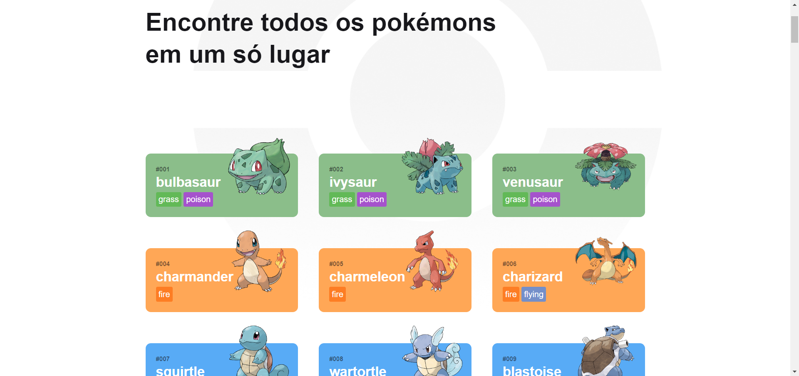

# Pokédex

This is a PWA built with react to simulate the famous Pokédex that made the childhood of millions of boys and girls around the world.

## Deploy

You can see it working [here](https://keuwey.github.io/react-pokedex/)

## Instalation

In order to try this project on your machine, you only have to clone this repo:

```bash
git clone https://github.com/keuwey/react-pokedex.git
```
And then enter the folder:

```bash
cd react-pokedex
```
Once you did this, then it's just to install the project:

```bash
npm install react-pokedex
npm run dev
```

Then the react app will open a port on your brower and it should be working fine!
## Functionalities

- Option to click on a card to see more information about it
- Dark and light themes *(Soon)*
- Option to add favourites *(Soon)*
## Screenshots



## Used stacks

**Front-end:** React, Redux, Axios, React-Router Styled-Components, Typescript (JSX)

**Back-end:** Vite, PokeAPI

As it is not done yet, I'm still working on it and I'm planning to add more functionalities to it, like let it full responsive with Bootstrap.